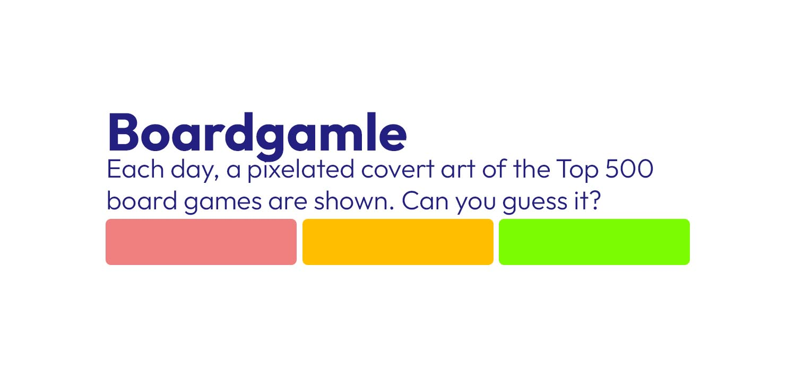

Introducing Boardgamle, the ultimate online gaming experience for board game enthusiasts! Each day, players are greeted with a pixelated rendition of a popular
board game's cover art, sourced from the prestigious Top 500 games of the renowned BoardGameGeek Database.

The challenge is clear: utilize your board game expertise and intuition to guess the mysterious title within five attempts.

---

React based web game, which fetches the cover art from BGG at runtime.

## Compiling the site

### Faster method:

For unix based systems:
```bash
npm run all_unix
```

For windows systems:
```bash
npm run all_win
```

### Step by step:

1. Download add nessery libraries

```bash
cd boardgamle
npm install
```

2. Build and run bgg_parser to fetch the current top-list of BGG. This will take some time.

```bash
npm run build_bgg_parser
npm run run_bgg_parser
```

3. Build the whole site and enjoy!

```bash
npm run build
```

# Issues

Please if you find any issues, report them here: [Issues](https://github.com/Gobli989/boardgamle/issues)

#### [ Dev's note ]

Sorry for the spagetti code. 💀